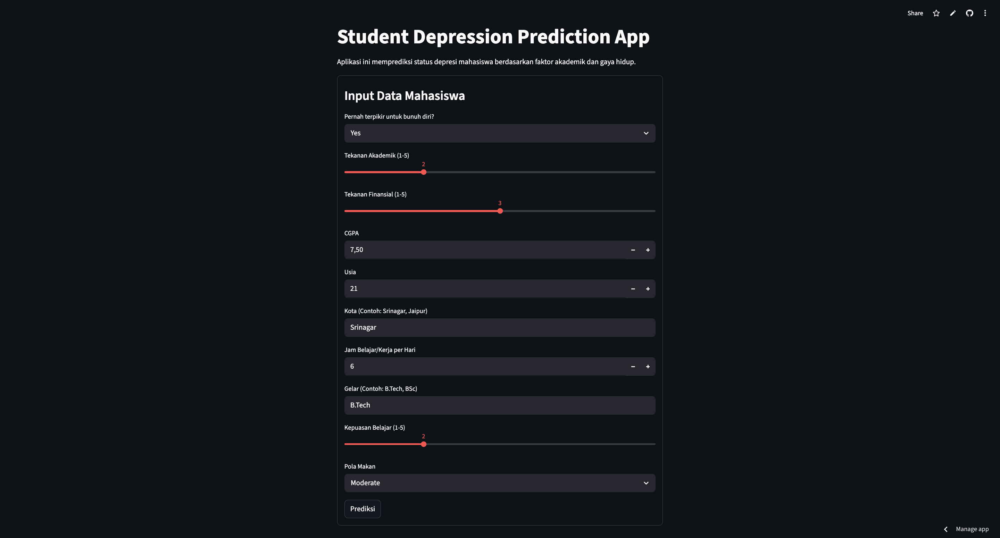
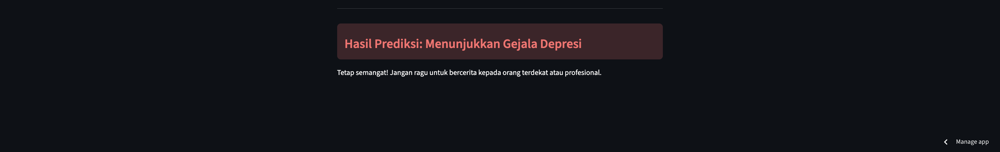

# Student Depression Prediction App

A simple Streamlit application that predicts depression risk for students using a pre-trained machine learning model.

## Demo Screenshot




## Overview

This app collects student data such as academic pressure, financial stress, CGPA, age, city, study/work hours, degree, study satisfaction, diet habits, and suicidal thoughts. It preprocesses the input, scales the features, and predicts whether the student is likely experiencing depressive symptoms.

## Features

- Streamlit web interface
- Collects student mental health and academic data
- Uses a saved `joblib` model and scaler
- Displays a clear prediction result

## Requirements

- Python 3.8+
- `streamlit`
- `pandas`
- `numpy`
- `scikit-learn`
- `joblib`

Install dependencies with:

```bash
pip install -r requirements.txt
```

## Run the App

From the project root:

```bash
streamlit run app.py
```

Then open the local Streamlit URL shown in your terminal.

## App Inputs

The form collects the following fields:

- Pernah terpikir untuk bunuh diri?
- Tekanan Akademik (1-5)
- Tekanan Finansial (1-5)
- CGPA
- Usia
- Kota
- Jam Belajar/Kerja per Hari
- Gelar
- Kepuasan Belajar (1-5)
- Pola Makan

## Files in this repository

- `app.py` - Streamlit application source code
- `requirements.txt` - Python dependencies
- `best_depression_model.joblib` - trained classification model
- `scaler.joblib` - feature scaler used for preprocessing
- `top_features.joblib` - selected top features for prediction

## Notes

- The app currently uses simple manual mappings for some categorical inputs.
- Make sure the feature encoding matches the training pipeline if you retrain the model.
- Keep the `joblib` artifacts in the same directory as `app.py`.

